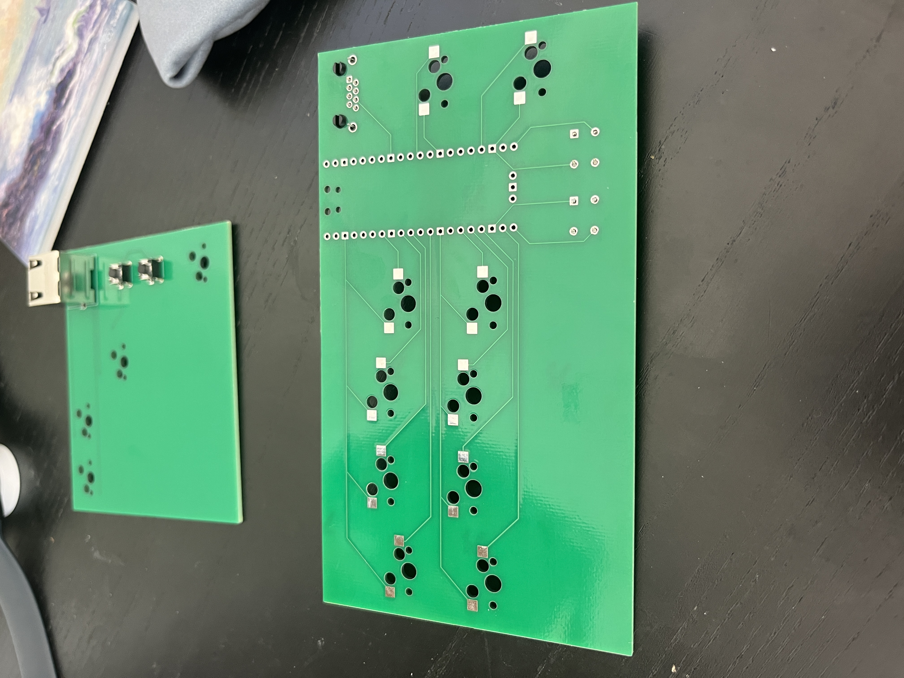
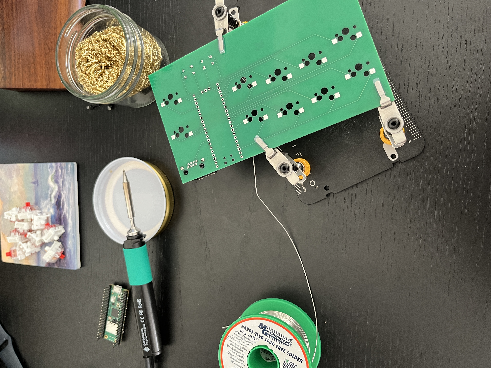
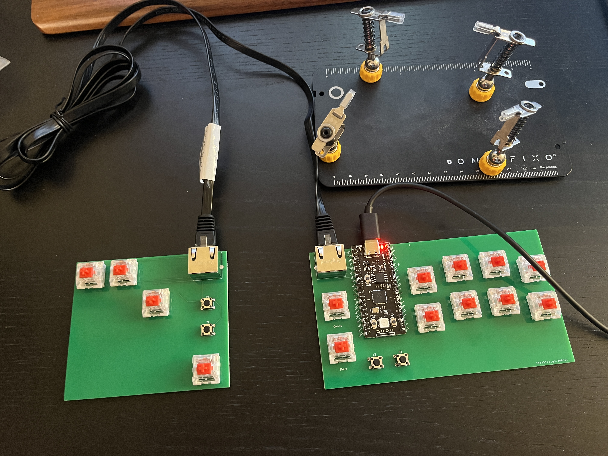
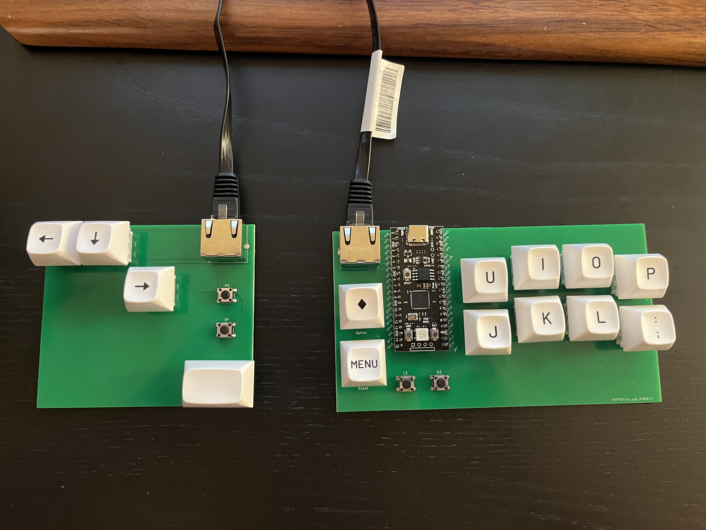

# Split Stickless Fighting Game Controller - Version 1
- Most commercial fighting game controllers all have very "crowded" layout. I wanted to make something that gives ample space between my left and right hands, and also learn how to design PCB from scratch. 

# Design 
- Split between left (Movement) and right (Other controls)
- Followed [ai03's PCB Design[(https://wiki.ai03.com/books/pcb-design)] guide for the KiCad part
- Uses RJ45 (Commonly used in Ethernet cables) to connect both sides 
    - TRRS Cables (Commonly used in headphone jacks with microphone) are usually used in split keyboards, but this only supports up to 4 connections.
    - I needed minimum 5 pins (UP, LEFT, RIGHT, DOWN, and GND) on the Left, so I had to use something with more connections. 
    - May explore with different connector in future revisions (USB Type C?)
- Uses GP2040-CE and has all the button mappings of a PS4 controller. So this could maybe "tournament legal", though I don't intend to use this in contests
- Also hotswappable! Bring any keyboard switch you want 

# Pin layout 

| GPIO Pin | Button | GPIO Pin  | Button |
| --- | --- | --- | --- |
| 00 | A1 (Capture) | 15 | L3 (LS) |
| 01 | Down | 16 | R3 (RS) | 
| 02 | A2 (Home) | 17 | R2 (RT) | 
| 03 | Up | 18 | L2 (LT) | 
| 04 | Right | 19 | B2 | 
| 05 | Left | 20 | B1 | 
| 06 | None | 21 | None | 
| 07 | None | 22 | R1 (RB) | 
| 08 | S2 (Share) | 23 | None | 
| 09 | None | 24 | None | 
| 10 | None | 25 | None | 
| 11 | None | 26 | L1 (LB) | 
| 12 | None | 27 | B4 | 
| 13 | S1 (Option) | 28 | B3 | 
| 14 | None | 29 | None |

See [Documentation](https://gp2040-ce.info/usage) for button mappings

# Parts 
- 1 Raspberry Pi Pico
- 2 Amphenol RJHSE-5380 (8P8C RJ45 female adapter)
- 4 Omron B3F-1020 switches (or any B3F-10x)
- 12 Cherry MX compatible switches of your choice 
- 12 Kailh Hotswap sockets
- 12 Keycaps of your choice

# PCB Design
Front

Back

# Assembly 
Finally got all the parts in mail and assembled the board. V-Cut groove was very easy to split.

And then soldered the components onto the board. Pi Pico I got was very hard to solder properly, but I managed to get everything done without shorting anything. 

After the assembly, I installed GP2040-CE firmware and tested every button is working as expected. Since I changed the pins for easy routing, my layout is different from the out of the box default. 

Luckily I somehow soldered everything fine and it worked perfectly. Put on some keycaps from my "Mechanical Keyboard days" for fun.

It is a little awkward so I'll need some time to get used to it, but I'm glad it all works correctly. Hotswap sockets are surprisingly sturdy and I don't think I would even need a face plate to hold the switches in place. I would still need some spacers with rubber feet to prevent boards from moving around, but it is ready for use now. 

Overall this was a very fun project, I'm glad I actually finished a project this time. I still have 4 more PCBs so I may assemble remainder when I get bored. Might also come back with V2 sometime in the future with more improvements. 

# ToDo 
- Exterior case / plate / feet for the board
- Rename KiCad project name from my-split to something meaningful 
