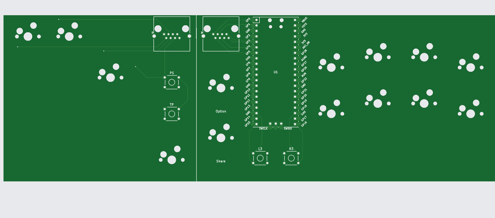
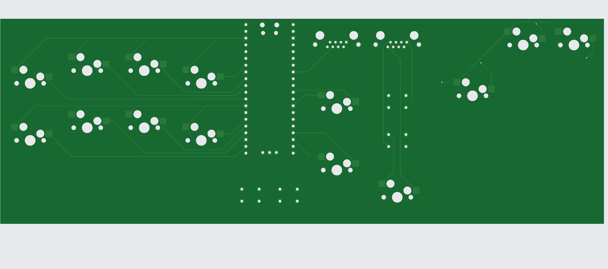

# Split Stickless Fighting Game Controller - Version 1
- Most commercial fighting game controllers all have very "crowded" layout. I wanted to make something that gives ample space between my left and right hands, and also learn how to design PCB from scratch. 

# Design 
- Split between left (Movement) and right (Other controls)
- Followed [ai03's PCB Design[(https://wiki.ai03.com/books/pcb-design)] guide for the KiCad part
- Uses RJ45 (Commonly used in Ethernet cables) to connect both sides 
    - TRRS Cables (Commonly used in headphone jacks with microphone) are usually used in split keyboards, but this only supports up to 4 connections.
    - I needed minimum 5 pins (UP, LEFT, RIGHT, DOWN, and GND) on the Left, so I had to use something with more connections. 
    - May explore with different connector in future revisions (USB Type C?)
- Uses GP2040-CE and has all the button mappings of a PS4 controller. So this could maybe "tournament legal", though I don't intend to use this in contests
- Also hotswappable! Bring any keyboard switch you want 

# Parts 
- 1 Raspberry Pi Pico
- 2 Amphenol RJHSE-5380 (8P8C RJ45 female adapter)
- 4 Omron B3F-1020 switches (or any B3F-10x)
- 12 Cherry MX compatible switches of your choice 
- 12 Kailh Hotswap sockets
- 12 Keycaps of your choice

# ToDo 
- Exterior case / plate for the board
  - Since I'm using Kailh hotswap sockets, I will probably need a plate to hold the switches in place 
- Rename KiCad project name from my-split to something else 

# PCB Design
Front

Back
